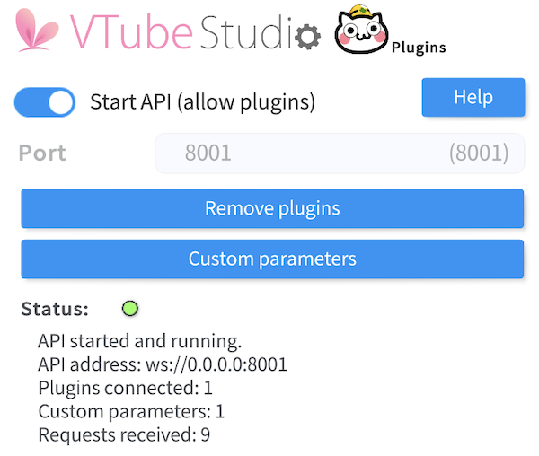
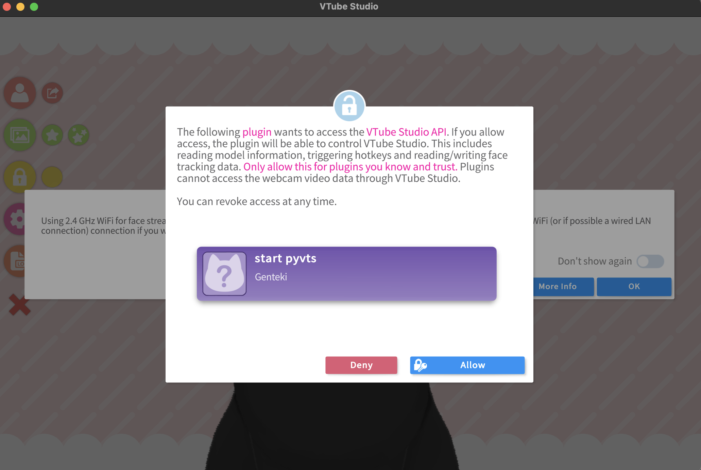

# Basic Usage

First import packages

```python
import asyncio, pyvts
```

Then specify your plugin info, you can use the default value and skip this step,

```python
plugin_info = {
    "plugin_name": "start pyvts",
    "developer": "Genteki",
    "authentication_token_path": "./token.txt"
}
```

Use ``async`` prefix to define a `main` function. Create `vts` instance in `main`.

```python
async def main():
    vts = pyvts.vts(plugin_info=plugin_info)
    await vts.connect()
```

Continue with `main` function, to get access of more features, we need to get authenticated from `Vtube Studio API`.

```python
    await vts.request_authenticate_token()  # get token
    await vts.request_authenticate()  # use token
```

Then you can do whatever you want, like add a new parameter/set values for parameter.

```python
    new_parameter_name = "start_parameter"
    await vts.request(
        vts.vts_request.requestCustomParameter(new_parameter_name)
    )  # add new parameter
```

After all, use `vts.close()` to disconnect from VTS and add `main` function to `async` quene.

```python
    if __name__ == "__main__":
        async.run(main())
```

After sucessfully connected, you will see in VTubeStudio settings



In `vts.request_authenticate_token`, it will request a token from `Vtube Studio API`, and save it in local file. While requesting token, a dialog will show up in VTube Studio app. Then, `vts.request_authenticate` will use the token to get accessed.

